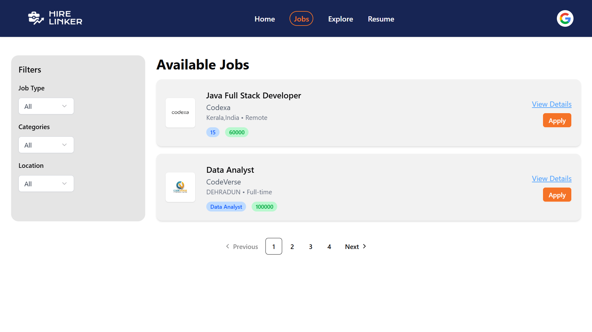
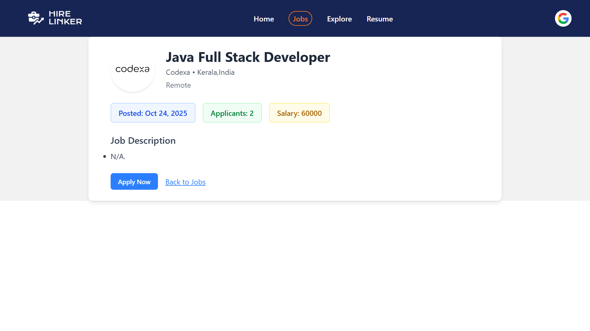
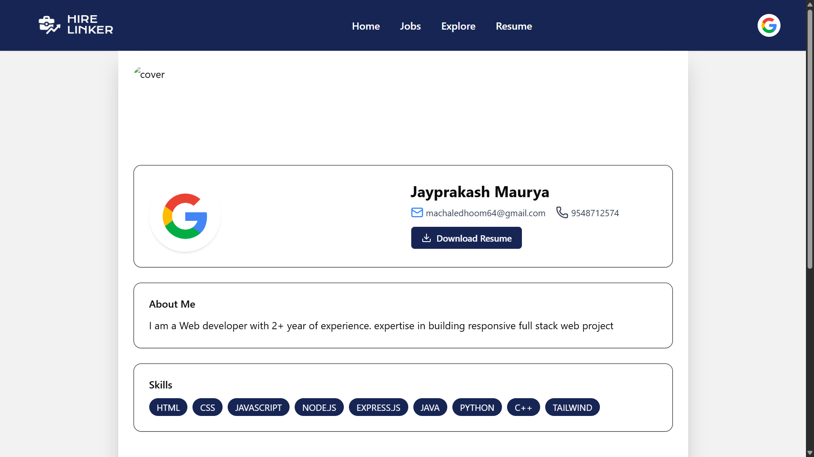
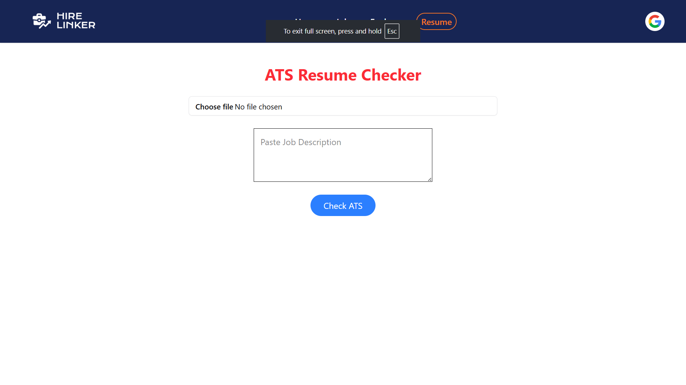

# JobPortal

A web-based Job Portal application where employers can post job listings and job seekers can search and apply for jobs.

## 🚀 Features
- User authentication (Job Seekers & Employers)
- Job posting & management
- Job search with filters
- Apply for jobs directly through the portal
- Admin dashboard (optional)

## 🛠️ Tech Stack
- **Frontend:** HTML,React,Redux Toolkit,Tailwind CSS,Shadcn UI,
- **Backend:** Node.js , Express.js (with JWT for authentication)
- **Database:** MongoDB, 
- **Version Control:** Git & GitHub

## Run Locally

git clone https://github.com/Jayprakash-1704/JobPortal.git
cd Job Portal
npm install
npm start

## Screenshots

